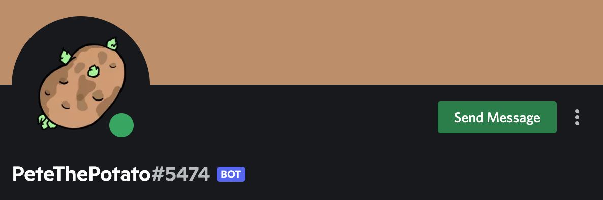

# Pete the Potato 

A discord bot developed using Python and the Discord Developer Portal and hosted using GitHub and Heroku. Its main function is to provide you with random facts about potatoes derived from various sources on the internet and stored in a text file. Use the command *!pete* to prompt Pete for a fact!

===================== As of 11/27/2022 Pete the Potato is no longer available ===================== 

[](https://www.python.org/) [](https://shields.io/) [](https://www.heroku.com) [](https://svgshare.com/i/ZjP.svg) [](https://github.com/sammurraytuesta)

<!-- TABLE OF CONTENTS -->
<details>
  <summary>Table of Contents</summary>
  <ol>
    <li><a href="#Program-Specification">Program Specification</a></li>
    <li>
      <a href="#Sample-Invocation">Sample Invocation</a>
      <ul>
        <li><a href="#help">!help</a></li>
        <li><a href="#pete">!pete</a></li>
      </ul>
    </li>
    <li>
      <a href="#Add-Pete-to-Your-Server">Add Pete to Your Server!</a>
      <ul>
        <li><a href="#Permissions">Permissions</a></li>
      </ul>
    </li>
    <li><a href="#Topgg">Top.gg</a></li>
    <li><a href="#Questions-or-Ideas">Questions or Ideas</a></li>
    <li><a href="#Thank-You">Thank You!</a></li>
</details>

## Program Specification 
  
Pete the Potato is a bot developed in Python and created using the Discord Developer Portal for fun potato facts in discord servers! He is hosted using GitHub and Heroku–a platform as a service (PaaS) that enables developers to build, run, and operate applications entirely in the cloud. Pete uses a text file to store all his knowledge on potatoes and parses the file to store each fact in a dictionary. Using this dictionary, Pete randomly selects a fact and sends it as a discord message to the user.



## Sample Invocation
The prefix *!* is how Pete knows he is being called. Use the prefix *!* in your discord server to get his attention!
  
### !help
By using the prefix *!* with the command *help* (example: *!help*), Pete will remind you how to call him and how to use his commands. The result should look like:

```
No Category:
  help Shows this message
  pete responds with a cool fact about potatoes!

Type !help command for more info on a command.
You can also type !help category for more info on a category.
```
  
As of right now, Pete's only command other than *!help* is *!pete* which is specified below!
  
### !pete
In your discord server, message Pete by using the prefix *!* with the command *pete* (example: *!pete*) to prompt Pete for a random fact about potatoes! See sample invocation below:


  
## Add Pete to Your Server!
Click the link below to add Pete to your server:
  
https://discord.com/api/oauth2/authorize?client_id=985337005074415616&permissions=274878028800&scope=bot

### Permissions
In connecting Pete to your server you are allowing him to:
- [x] Read Messages
- [x] Send Messages
- [x] Send Messages in Threads
- [x] Send TTS Messages
- [x] Embed Links (for future developments)
- [x] Attach Files (for future developments)
- [x] Read Message History
  
Note: Pete **cannot** read or send messges as you.

## Top.gg
You can also find pete on Top.gg, the #1 discord bot list! Link below!

https://top.gg/bot/985337005074415616

Feel free to tell pete he's doing a good job!
  
## Questions or Ideas
For any questions you may have about Pete feel free to join PeteThePotato's Official Discord Server and send your questions to the question channel. For any ideas that you may have to make Pete better, message the idea channel! 

Link to join PeteThePotato's Official Discord Server:

https://discord.gg/5AW6GQXk
  
## Thank You!
Enjoy all the potato facts!
